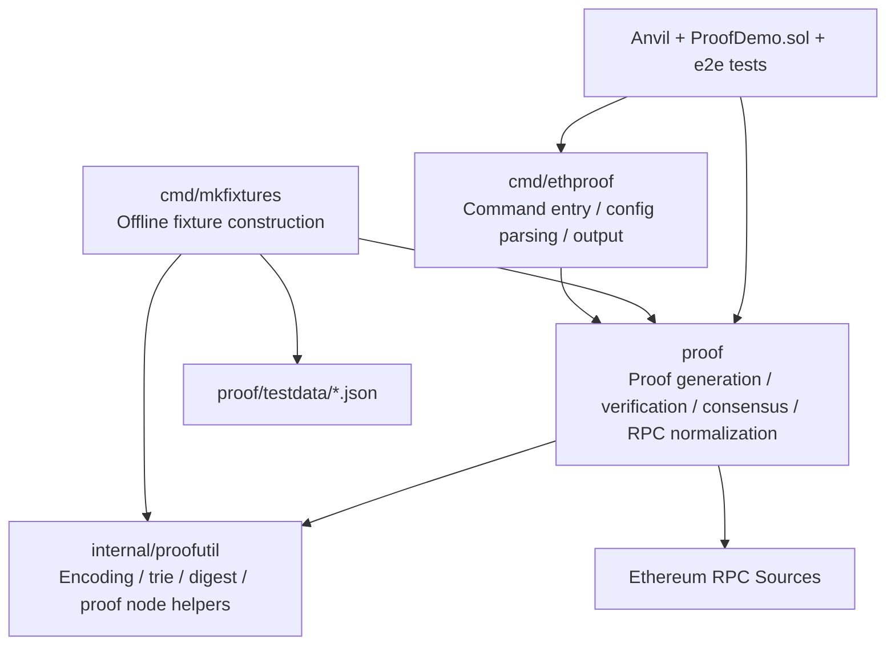
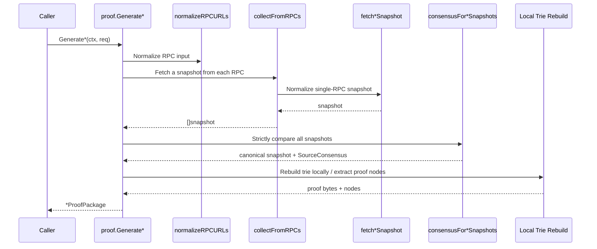

# eth-proof Design

## 1. Document Purpose

This document describes the code organization, runtime architecture, key data flows, and design constraints of `eth-proof`. The target audience is future maintainers, refactorers, and engineers who need to add capabilities on top of the current implementation.

`README.md` primarily answers “what this tool does” and “how to use it”; this document primarily answers “how the code is layered”, “why it is designed this way”, and “which boundaries must be preserved when making changes”.

## 2. Design Goals and Boundaries

### 2.1 Goals

- Provide three types of Ethereum MPT proofs:
  - `state`
  - `receipt`
  - `transaction`
- Support two verification modes:
  - fully offline verification
  - offline verification + independent RPC block header revalidation
- Use a strict multi-RPC consistency model for live proof generation.
- Keep the CLI thin and centralize proof correctness logic in `proof/`.
- Provide deterministic offline fixtures so tests do not depend on external networks.

### 2.2 Non-goals

- Do not implement 2-of-3 quorum, voting, or tolerance-based repair.
- Do not implicitly trust a single RPC anywhere inside the proof package.
- Do not turn the CLI into a business logic layer.
- Do not change the public proof JSON structure unless a schema change is explicitly required.

## 3. Overall Architecture



### 3.1 Layering Principles

- `cmd/ethproof`
  - Responsible for argument parsing, config merging, output, and exit codes.
  - Does not contain proof correctness logic.
- `proof`
  - The core of the repository.
  - Owns the public APIs for the three proof types, snapshot collection, strict consistency checks, local trie proof verification, and independent RPC block revalidation.
- `internal/proofutil`
  - Contains only low-level infrastructure:
    - transaction/receipt encoding and decoding
    - trie proof node dumping / proof DB construction
    - canonical digests
    - storage proof value encoding and decoding
  - Does not contain business semantics or proof rules.
- `cmd/mkfixtures`
  - Responsible only for constructing deterministic offline samples.
  - Reuses the public models from `proof` and the low-level helpers from `internal/proofutil`.

## 4. Repository Structure and Responsibilities

| Path | Role |
| --- | --- |
| `proof/types.go` | Public proof data models and request models |
| `proof/state.go` | Public generation/verification entrypoints for `state` proof |
| `proof/receipt.go` | Public generation/verification entrypoints for `receipt` proof |
| `proof/transaction.go` | Public generation/verification entrypoints for `transaction` proof |
| `proof/verify_rpc.go` | Entry for “offline verification + independent RPC block header revalidation” |
| `proof/rpc_sources.go` | RPC connection lifecycle and `collectFromRPCs` |
| `proof/rpc_headers.go` | Block header fetching and header snapshots |
| `proof/rpc_state_snapshot.go` | Normalization of a single-RPC state snapshot |
| `proof/rpc_receipt_snapshot.go` | Normalization of a single-RPC receipt snapshot |
| `proof/rpc_transaction_snapshot.go` | Normalization of a single-RPC transaction snapshot |
| `proof/state_consensus.go` | State snapshot comparison and consensus metadata generation |
| `proof/receipt_consensus.go` | Receipt snapshot comparison and consensus metadata generation |
| `proof/transaction_consensus.go` | Transaction snapshot comparison and consensus metadata generation |
| `proof/consensus_shared.go` | Shared consistency-comparison entrypoint reused across proof types |
| `proof/proof_helpers.go` | Trie proof construction and local proof verification helpers |
| `proof/common.go` | Generic comparisons, `BlockContext` assembly, RPC URL normalization |
| `internal/proofutil/proofutil.go` | Encoding, digest, proof node, and trie helpers |
| `cmd/ethproof/*.go` | CLI command dispatch, config parsing, thin generate/verify wrappers |
| `cmd/mkfixtures/*.go` | Fixture construction, offline digests, shared helpers |
| `proof/testdata/*.json` | Deterministic offline fixtures |
| `proof/*_test.go` | Core proof unit tests, fixture regression tests, verify-RPC tests, e2e |
| `contracts/ProofDemo.sol` | Minimal contract used by local e2e |
| `internal/e2e/bindings/proofdemo.go` | Generated Go binding, must not be edited by hand |

## 5. Public Data Model

### 5.1 Core Models

- `BlockContext`
  - The block header fields that anchor a proof.
  - Includes `SourceConsensus`, which records how the proof was agreed across multiple RPCs.
- `SourceConsensus`
  - Records:
    - the participating RPC list
    - digests of normalized inputs
    - field lists for human auditability
- `StateProofPackage`
  - account proof + single storage slot proof
- `ReceiptProofPackage`
  - receipt inclusion proof + event claim
- `TransactionProofPackage`
  - transaction inclusion proof

### 5.2 Design Notes

- A proof package itself is fully verifiable offline.
- `verify ... AgainstRPCs` only performs an additional independent check of the block context after offline verification succeeds.
- RPC metadata from generation is never reused by verify logic.

## 6. Shared Processing Pipeline for the Three Proof Types

The architecture of the three live generation flows is the same; only the snapshot contents differ.



### 6.1 Shared Steps

1. `normalizeRPCURLs`
   - trims whitespace, deduplicates, and validates the minimum RPC count.
2. `collectFromRPCs`
   - centralizes RPC connection open/close lifecycle.
   - uniformly prefixes per-source errors with the RPC URL.
3. `fetch*Snapshot`
   - converts raw responses from a single RPC into a comparable normalized structure.
4. `requireMatchingSnapshots`
   - compares every snapshot against the normalized view from the first source.
   - any difference is a hard failure.
5. `build*Consensus`
   - generates `SourceConsensus`.
6. Local trie rebuild / local proof verification
   - the system does not trust an RPC to “prove itself correct”.

## 7. State Proof Design

### 7.1 Data Model

The `state` proof represents:

```text
account ⊂ state trie -> stateRoot
slot ⊂ storage trie(account.storageRoot) -> storageRoot ⊂ account
```

### 7.2 Key Files

- `proof/state.go`
- `proof/rpc_state_snapshot.go`
- `proof/state_consensus.go`
- `proof/proof_helpers.go`

### 7.3 Generation Flow

1. Fetch from every RPC:
   - block header
   - `eth_getProof(account, [slot], block)`
2. Normalize:
   - sort proof node lists
   - extract the account claim as `nonce/balance/storageRoot/codeHash`
   - normalize the storage value into `common.Hash`
3. Perform local pre-verification:
   - `verifyAccountProof`
   - `verifyStorageProof`
4. After all RPC snapshots agree strictly:
   - generate `StateProofPackage`

### 7.4 Why It Is Designed This Way

- `eth_getProof` is an RPC dependency point, but proof correctness does not depend on the RPC’s “word”.
- Verifying each source proof locally before entering consensus avoids the case where multiple incorrect RPCs are merely “consistently wrong”.

## 8. Receipt Proof Design

### 8.1 Data Model

```text
log ⊂ receipt ⊂ receipts trie -> receiptsRoot
```

### 8.2 Key Files

- `proof/receipt.go`
- `proof/rpc_receipt_snapshot.go`
- `proof/receipt_consensus.go`
- `proof/proof_helpers.go`

### 8.3 Generation Flow

1. Reuse the transaction snapshot first to lock:
   - the block containing the tx
   - the tx index
   - canonical transaction bytes
2. Fetch the target receipt.
3. Fetch all block receipts:
   - prefer `eth_getBlockReceipts`
   - fall back to per-transaction `TransactionReceipt` scanning if unsupported
4. Validate:
   - the target receipt bytes must equal the bytes at the corresponding position in the block receipt list
5. Rebuild the receipts trie locally and export the inclusion proof.
6. Reduce the target log into `EventClaim{address, topics, data}`.

### 8.4 Why It Is Designed This Way

- A receipt proof does not only prove that the receipt is in the trie; it must also prove that the event claimed in the package is exactly the specified log inside that receipt.
- The “point lookup vs full block list” cross-check helps detect inconsistencies inside the RPC itself.

## 9. Transaction Proof Design

### 9.1 Data Model

```text
transaction ⊂ transactions trie -> transactionsRoot
```

### 9.2 Key Files

- `proof/transaction.go`
- `proof/rpc_transaction_snapshot.go`
- `proof/transaction_consensus.go`
- `proof/proof_helpers.go`

### 9.3 Generation Flow

1. Lock the transaction’s block and index from the receipt.
2. Fetch the full block transaction list.
3. Cross-check the target tx bytes against the transaction bytes at the same index in the block body.
4. Rebuild the transactions trie locally and export the proof nodes.

### 9.4 Why It Is Designed This Way

- The flow first uses the receipt to lock block/index, then uses the block body to rebuild the trie, instead of depending on a single lookup result.

## 10. Multi-RPC Consistency Model

### 10.1 Basic Rules

- By default, at least 3 distinct RPCs are required.
- There is no quorum fallback.
- Comparisons are performed on normalized bytes/fields, not on fuzzy high-level semantics.

### 10.2 Normalized Contents

- `state`
  - block header
  - account proof nodes
  - account RLP
  - decoded account claim
  - storage proof nodes
  - normalized storage value
- `receipt`
  - block header
  - target tx bytes
  - target receipt bytes
  - block transaction list
  - block receipt list
  - event claim
- `transaction`
  - block header
  - target tx bytes
  - block transaction list

### 10.3 Code Locations

- `proof/consensus_shared.go`
- `proof/state_consensus.go`
- `proof/receipt_consensus.go`
- `proof/transaction_consensus.go`
- `proof/common.go`

## 11. Offline Verification and RPC Revalidation

### 11.1 Offline Verification

Public entrypoints:

- `VerifyStateProofPackage`
- `VerifyReceiptProofPackage`
- `VerifyReceiptProofPackageWithExpectations`
- `VerifyTransactionProofPackage`

Characteristics:

- Depends only on the proof package itself.
- Does not access the network.
- Core logic lives in `proof/proof_helpers.go` and the verify flow inside `proof/*.go`.

### 11.2 RPC-aware Verification

Public entrypoints:

- `VerifyStateProofPackageAgainstRPCs`
- `VerifyReceiptProofPackageWithExpectationsAgainstRPCs`
- `VerifyTransactionProofPackageAgainstRPCs`

Processing order:

1. Perform local proof verification first.
2. Re-fetch the block header from an independent verify RPC set.
3. First require agreement across the verify RPCs.
4. Then require the proof package’s `BlockContext` to match that independent view.

This logic is centralized in `proof/verify_rpc.go`.

## 12. CLI Design

### 12.1 Design Principles

- The CLI only coordinates entrypoints; it does not make proof business decisions.
- `--config` is the primary input layer, and flags act as overrides.

### 12.2 Key Files

| Path | Responsibility |
| --- | --- |
| `cmd/ethproof/run.go` | root command dispatch, error rendering, exit codes |
| `cmd/ethproof/generate.go` | thin wrapper for generate subcommands |
| `cmd/ethproof/verify.go` | thin wrapper for verify subcommands |
| `cmd/ethproof/config.go` | config JSON structure and loading |
| `cmd/ethproof/parse_common.go` | shared flag/config/default merge logic |
| `cmd/ethproof/parse_generate.go` | generate argument parsing |
| `cmd/ethproof/parse_verify.go` | verify argument parsing |
| `cmd/ethproof/usage.go` | usage error / help semantics |

### 12.3 Runtime Flow

1. `main -> runMain -> run`
2. Dispatch subcommands to `generate` / `verify`
3. Parse configuration
4. Create a timeout-bounded context
5. Call the `proof` package
6. Print the result

## 13. Fixture and Test Design

### 13.1 Offline Fixture

`cmd/mkfixtures` provides deterministic offline sample construction:

- `fixtures.go`
  - unified assembly entrypoint `BuildOfflineFixtures`
- `transaction_receipt_fixture.go`
  - transaction / receipt fixture construction
- `state_fixture.go`
  - state fixture construction
- `consensus_helpers.go`
  - offline digest / consensus field construction
- `shared.go`
  - shared helpers

### 13.2 Test Layers

- `proof/proof_test.go`
  - fixture golden comparisons
  - tamper regression
- `proof/verify_rpc_test.go`
  - verify-RPC revalidation path
- `proof/consensus_helpers_test.go`
  - compare / consensus builder / `collectFromRPCs`
- `proof/rpc_test.go`
  - receipt list encoding and validation
- `cmd/mkfixtures/helpers_test.go`
  - offline digest stability, proof node ordering, encoding roundtrip
- `proof/anvil_e2e_test.go`
  - local Anvil end-to-end path

### 13.3 Why It Is Designed This Way

- Fixtures keep unit tests independent from external networks.
- e2e ensures that the CLI, proof package, contract, bindings, and Anvil environment work together.
- Live tests depend on explicit environment variables so default local or CI test runs remain stable.

## 14. Key Invariants

The following invariants must be preserved when changing the code:

1. Do not weaken the strict multi-RPC consistency model.
2. Do not change the public JSON structure in `proof/types.go` unless a schema change is explicitly required.
3. CLI `verify` must use an independent verify RPC set and must not reuse generation metadata.
4. Public `Verify*ProofPackage` APIs must remain usable offline.
5. `internal/e2e/bindings/proofdemo.go` is generated output and must not be edited by hand.
6. Logic related to proof correctness should stay in `proof/`; do not duplicate it in the CLI.

## 15. Extension and Refactoring Guidance

### 15.1 If a New Proof Type Is Added

The recommended pattern is to add a matching set of files:

- `proof/<kind>.go`
- `proof/rpc_<kind>_snapshot.go`
- `proof/<kind>_consensus.go`

And reuse:

- `collectFromRPCs`
- `requireMatchingSnapshots`
- `proofutil`

### 15.2 If Encoding or Proof Semantics Change

The following must be checked together:

- `proof/testdata/*.json`
- `cmd/mkfixtures/*`
- `proof/proof_test.go`
- `proof/anvil_e2e_test.go`

### 15.3 If the CLI Changes

The following must be checked together:

- `cmd/ethproof/parse_*`
- `cmd/ethproof/*_test.go`
- `README.md`
- `config.example.json`

## 16. Summary

The core ideas of this repository are:

- keep proof correctness in `proof/`
- isolate low-level encoding/trie/byte helpers in `internal/proofutil`
- keep the CLI as a thin wrapper
- build trust in live generation on “strict normalized consistency + local reconstruction/verification”

As a result, future changes should prioritize preserving these four lines of architecture rather than locally reducing a few lines of code or abstracting for abstraction’s sake.
